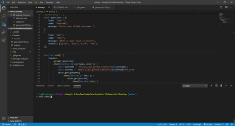

# Developer Profile Generator

This is a command line application that generates a developer gitHub profile pdf document. 
The user is prompted for the developer name and a favorite color. 
This application is built with node.js and uses axios, inquirer, html-pdf, and open. 

run npm install
run node index.js

Dependencies to install axios, inquirer, html-pdf, open.

gitHub repository: https://github.com/TravisGuillory/DeveloperProfileGenerator

<iframe src="https://giphy.com/embed/hqOpaPQzo0DyyT8JvV" width="480" height="258" frameBorder="0" class="giphy-embed" allowFullScreen></iframe>
<a href="https://giphy.com/gifs/hqOpaPQzo0DyyT8JvV">via GIPHY</a>

  
